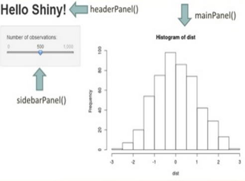

# 傢俬準備好


## 環境安裝

R 套件安裝
```{r Surround, eval=FALSE}
install.packages(c("dplyr","ggplot2","shiny","devtools"))
devtools::install_github('rstudio/shinyapps')
```
```{r echo=FALSE,eval=FALSE}
sessionInfo()
```

# shiny shiny little star

## 甚麼是shiny ?

- Web Application Framework for R
- Reactive Programming (Interactive user interfaces)
- Default UI theme Bootstrap (Twitter Bootstrap)
- Support HTML/CSS/JavaScript/Markdown
- Provided by RStudio from 2012-11 Beta
- Until now 2015-05 v0.11

## 為什麼要選shiny

- Let R User become a simple web designer/devoleper  
- Using R language then you can create web app  
    - know more about HTML/CSS/Javascript will be better  
- Support HTML element  
    - Input: select, checkbox, radio, etc...  
    - Output: text, table, plot, etc...  

## Shiny的運作原理

- 基本架構  
    - `ui.R`: 客戶端，負責前端使用者介面的呈現 
    - `server.R`: 伺服器端，負責後端資料處理與計算
    - `global.R(optional)`: 放置ui與server共用的設定(`source`、`data`)

<div class="columns-2">
  

  
</div>

## `ui.R`  

<div class="columns-2">
  

  
</div>

## `server.R`

- Environment Variable  
    - 最外層 Run once: 讀套件、data  
- `shinyServer()`
    - 第一層 Function(), Run once per user
        - input list, output list, session
    - 第二層 Render Function, Run often
        - 建立輸出元件

# I want learn more

## Layout

通常指網頁版面，頁面的形式，佈局

- Sidebar Layouts(Simple default layout)
- Grid Layouts  
    - Custom application layouts: fluid & fixed
    - `fluidPage(fluidRow(column()))`
        - a flexibly sub-dividable 12-column grid for layout
- Segmenting Layouts
    - `navbarPage(tabPanel(), navbarMenu())`
    - `tabsetPanel(tabPanel()), navlistPanel(tabPanel())`
- Responsive Layout
    - automatically adapt its layout for viewing on different sized devices

## Layout


[Responsive Layout](http://goo.gl/x7fh2U)

## Useful Layout {.flexbox .vcenter}


## Navlist with ggplot2

<div class="code_block">  

```{r eval=FALSE}
runApp("apps/barplot")
##########
# ui.R   #
##########
library(shiny)
library(ggplot2)
library(dplyr)
 
shinyUI(fluidPage(
  titlePanel("Navlist panel example"),
  
  navlistPanel("header",
               selectInput('cut', 'cut', levels(diamonds$cut)), #字串可以用unique
               tabPanel("First",plotOutput('plot1')
               ),
               tabPanel("Second",
                        dataTableOutput(outputId="table")
               )
  )
))
############
# server.R #
############
library(shiny)
library(ggplot2)
library(dplyr)

shinyServer(function(input, output, session) {
   
    selectedData <- reactive({
      filter(diamonds,cut == input$cut)
    })
    output$plot1 <- renderPlot({
      bike.3p <- ggplot(data = selectedData(), 
                        aes(x = reorder(clarity, -price), y = price, colour = clarity, fill = clarity)) 
      bike.3p + geom_bar(stat="identity", width=0.5) + coord_flip()
      # geom_text can't using chinese text
      })
    output$table <- renderDataTable(selectedData())  
   
})
```

</div>

## Reactivity

<div class="notes">
This is my *note*.

- It can contain markdown
- like this list

</div>


## Slide with Interactive Plot

```{r, echo=FALSE}
inputPanel(
  selectInput("n_breaks", label = "Number of bins:",
              choices = c(10, 20, 35, 50), selected = 20),
  
  sliderInput("bw_adjust", label = "Bandwidth adjustment:",
              min = 0.2, max = 2, value = 1, step = 0.2)
)

renderPlot({
  hist(faithful$eruptions, probability = TRUE, breaks = as.numeric(input$n_breaks),
       xlab = "Duration (minutes)", main = "Geyser eruption duration")
  
  dens <- density(faithful$eruptions, adjust = input$bw_adjust)
  lines(dens, col = "blue")
})
```


# 其他整合應用

## ggvis

- 2014年中才放在CRAN的套件，持續成長中
- 使用pipe，語法類似plot
- 部分功能如tooltip需搭配shiny server才能使用
- SVG

```{r message=FALSE, echo=TRUE, warning=FALSE}
library(knitr)
library(ggvis)
out = mtcars %>%
    ggvis(x = ~wt, y = ~mpg) %>%
    layer_smooths(se=TRUE, opacity := 0.5, opacity.hover := 0.75) %>% 
    layer_points(fill = ~factor(cyl), size := 50, size.hover := 200) %>%
    set_options(hover_duration = 250) 
```

## ggvis

```{r message=FALSE, echo=FALSE, fig.height=5, fig.width=8}
out
```


