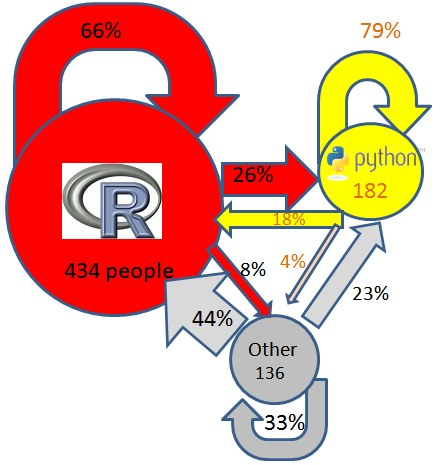
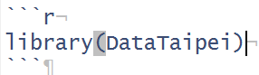

```{r setup, include = FALSE}
knitr::opts_chunk$set(comment="", message=FALSE, warning=FALSE, eval = FALSE) #mark subtitle,runtime and add eval=FALSE
library(knitr)
library(shiny)
library(rmarkdown)
library(ggplot2)
library(ggvis)
if (!file.exists("data/ubikeweather_utf8.rda")) {
  load("data/ubikeweather_big5.rda")
  for(i in seq_len(ncol(ubike))) {
    if (class(ubike[[i]]) != "character") next
    ubike[[i]] <- iconv(ubike[[i]], from = "BIG-5", to = "UTF-8")
  }
  save(list = "ubike", file = "data/ubikeweather_utf8.rda")
  rm(list = "ubike")
}
```

## About Me

<h3>Wush Wu</h3>

<div class="columns-2">

- 台大電機博士生
    - 研究網路廣告即時競標平台(RTB)上的問題
    - 撰寫與維護商業用網路廣告推薦引擎（酷比廣告）
- Taiwan R User Group 的共同創辦人
    - 曾貢獻過多個R 語言套件，包含今天會用到的`knitr`

</br>
</br>
</br>
</br>


</div>

# 傢俬準備好


## 環境安裝 {.flexbox .vcenter}

R 套件安裝

```{r Surround, eval=FALSE}
install.packages(c("dplyr","ggplot2","shiny","devtools", "rmarkdown"))
devtools::install_github('rstudio/shinyapps')
```

# 如何輸出R 的統計分析結果

## 傳統的分析流程 {.flexbox .vcenter}

- 使用Excel 或其他工具匯入資料至SAS 、SPSS或R 等分析工具
- 運用分析工具產生分析結果
- 運用滑鼠點點貼貼，將輸出結果複製到Word或其他文件製作工具
    - 可以運用VBA 自動產生報表
- 運用Tableau互動式的檢視資料

## R 語言提供完整的分析解決方案 {.flexbox .vcenter}

- 富有驚人的彈性，能撰寫出千變萬化的功能
- 針對數據分析的需求，延生出大量的套件
- 在2012年左右，謝益輝博士運用[knitr](http://yihui.name/knitr/)解決輸出報表工具的問題
- 在2015年的今天，學習一個R 語言：
    - 爬資料，例如：[DataTaipei](https://github.com/TaipeiRHackers/DataTaipei)
    - 資料的載入、資料的整理：[dplyr](http://cran.rstudio.com/web/packages/dplyr/vignettes/introduction.html)
    - 資料的分析與視覺化：[ggplot2](http://cran.r-project.org/web/packages/ggplot2/index.html)
    - 報表的製作：[rmarkdown](http://rmarkdown.rstudio.com/)
    - 動態圖表的建置：[shiny](http://shiny.rstudio.com/)

## 跟著時代的潮流走 {.flexbox .vcenter}



出處：<http://www.kdnuggets.com/2015/05/r-vs-python-meetup-report.html>

# rmarkdown

## 內建整合至Rstudio的文件撰寫模組 {.flexbox .vcenter}

- 投影片
- Word 報告
- 網頁

## 我們的目標 {.flexbox .vcenter}

- 建造**可重複使用**的分析報表
- 著重於報告內容
- 美觀？還是建議使用Power Point系列
    - 時機未到。革命尚未成功，同志仍需努力：貢獻吧！
    - 如果熟悉HTML、JavaScript和CSS，則可以製作出令人驚豔的效果

## 坐而言不如起而行 - Hello rmarkdown {.flexbox .vcenter}

- 請跟著講師學習：
    - 如何利用Rstudio建立rmarkdown文件
    - 如何編譯rmarkdown文件（可能需要安裝額外的套件）

## rmarkdown的運作原理 {.flexbox .vcenter}

- 透過[knitr](http://yihui.name/knitr/)將`.Rmd`檔案轉換為`.md`檔案
- 利用[pandoc](http://pandoc.org/)將`.md`轉換為指定的格式

# 如何撰寫rmarkdown

## 設定區 {.flexbox .vcenter}

- 
    ```
    ---
    title: "Untitled"
    output: word_document
    ---
    ```

## 小練習 {.flexbox .vcenter}

- 讓我們更改預設的文件內容標題，再重新編譯

## 常用rmarkdown的格式 {.flexbox .vcenter}

- 標題：`#`、`##`、`###`、`####`、`#####`、...
- 分段落：兩個斷行
- 斜體：`*文字*`、粗體：`**文字**`
- 網址：`<>`、超連結：`[顯示內容](http://網址)`、圖片：``
- 行內程式碼：`\`程式碼\``
- 區段程式碼：

## R Chunk {.flexbox .vcenter}

rmarkdown允許我們直接將R 的輸出嵌入到報告之中：

- 執行的程式碼
- Console 的輸出
- 圖片
- 報表

## Hello R Chunk {.flexbox .vcenter}

- 利用\`\`\`{r}來開啟一個R Chunk
- 利用\`\`\` 來關閉一個R Chunk

## 小練習 {.flexbox .vcenter}

- 請在R Console上執行：

- 在文件中輸入:　\`\`\`{r}
- 


貼至Rmd文件之中，編譯後觀看結果

# shiny shiny little star

## 甚麼是shiny ?

<div class="columns-2">

- 一個基於R 語言的網頁應用框架
    - 可以用R 快速製作網頁應用
    - 利用近代網頁技術製作動態網頁
    - 分析結果「會動了」
- 由 RStudio 於 2012-11 年正式提出Beta版
- 目前於 2015-05 釋出 v0.11

```{r shiny-example, echo = FALSE}
inputPanel(
  selectInput("n_breaks", label = "Number of bins:",
              choices = c(10, 20, 35, 50), selected = 20)
)

renderPlot({
  hist(faithful$eruptions, probability = TRUE, breaks = as.numeric(input$n_breaks),
       xlab = "Duration (minutes)", main = "Geyser eruption duration")
  
  dens <- density(faithful$eruptions, adjust = 1)
  lines(dens, col = "blue")
})
```

</div>

## 學Shiny的好處是？

<div class="columns-2">
- 目前R中互動式分析報表最簡單的工具
    - 需要理解網頁應用的運作原理
    - **不需要**理解撰寫網頁應用工具（HTML、CSS和Javascript)，但是若想要擴充Shiny，則需要會這些工具
    - **不需要**改寫已經用R 撰寫的分析流程，但是若希望能提供流暢的使用者體驗，則需要適度的優化
- 可以和現代的Javascript視覺化函式庫做整合
    - [Introducing ggvis](http://blog.rstudio.org/2014/06/23/introducing-ggvis/)
    - [htmlwidgets: JavaScript data visualization for R](http://blog.rstudio.org/2014/12/18/htmlwidgets-javascript-data-visualization-for-r/)

```{r ggvis-example, echo = FALSE}
bootstrapPage(
  ggvisOutput("p"),
  uiOutput("p_ui")
)

mtcars %>%
  ggvis(~wt, ~mpg) %>%
  layer_points() %>%
  layer_smooths(span = input_slider(0, 1)) %>%
  bind_shiny("p", "p_ui")
```

</div>

# Shiny 概觀

## 網頁應用的運作原理 {.flexbox .vcenter}

- 客戶端：
    - 瀏覽器進行畫面的呈現
    - 瀏覽器和使用者進行互動
        - 依據互動的過程，瀏覽器隨時會和伺服器交換資料
            - 瀏覽器發出*Request*
            - 伺服器回傳*Response*
- 伺服器端：
    - 伺服器提供畫面的規格給瀏覽器
    - 伺服器再依據瀏覽器提供的資訊，回傳使用者需要的資料

## Shiny的運作原理

- 基本架構  
    - `ui.R`: 客戶端，負責前端使用者介面的呈現 
    - `server.R`: 伺服器端，負責後端資料處理與計算

<div class="columns-2">
  

  
</div>

## Shiny - 客戶端輸入：`ui.R`

- shiny 會將 `ui.R`的R 物件轉換為HTML、CSS和Javascript，透過瀏覽器呈現
- 透過Javascript，瀏覽器會將使用者的動作轉換為Request發回給Server

```{r ui1, echo=TRUE}
inputPanel(
  selectInput("n_breaks", label = "Number of bins:",
              choices = c(10, 20, 35, 50), selected = 20)
)
```

```{r ui2, engine='R', results='markup', echo=FALSE}
print(inputPanel(
  selectInput("n_breaks", label = "Number of bins:",
              choices = c(10, 20, 35, 50), selected = 20)
))
```

## Shiny - 伺服器端：`server.R`

- Shiny server處理瀏覽器傳來的Request，轉化為R 中的`input`
- 我們撰寫R 函數將`input`轉換為`output`
- Shiny server再把`output`轉換為`Response`傳回瀏覽器

```{r server-demo, echo = TRUE, eval = FALSE}
function(input, output) {
  output$plot <- renderPlot({
    hist(faithful$eruptions, probability = TRUE, breaks = as.numeric(input$n_breaks),
         xlab = "Duration (minutes)", main = "Geyser eruption duration")
    
    dens <- density(faithful$eruptions, adjust = 1)
    lines(dens, col = "blue")
  })
}
```

## Shiny - 客戶端輸出：`ui.R`

- 透過Javascript，瀏覽器會將Server回傳的`Response`呈現在瀏覽器上

```{r ui3, echo = TRUE, eval = TRUE, results='markup'}
print(plotOutput("plot"))
```

```{r s2, echo = FALSE}
inputPanel(
  selectInput("n_breaks2", label = "Number of bins:",
              choices = c(10, 20, 35, 50), selected = 20)
)

renderPlot({
  hist(faithful$eruptions, probability = TRUE, breaks = as.numeric(input$n_breaks2),
       xlab = "Duration (minutes)", main = "Geyser eruption duration")
  
  dens <- density(faithful$eruptions, adjust = 1)
  lines(dens, col = "blue")
})
```

# Hello shiny

## 如何執行 shiny apps

學習shiny，先從範例模仿  

1. 從Rstudio建立shiny apps: 
    + step1 Create Project   
    + step2 選 Shiny Web Application   
    + step3 檔案目錄代表app名稱    
2. 載入已建立好的apps(即目錄名稱)
3. `runApp`  

## 小挑戰 1 -- Run App

- 依照前述的操作，建立一個Shiny App，名叫：DSPShinyCourse

**HINT**  
```
從Rstudio建立shiny apps: 
    step1 Create Project   
    step2 選 Shiny Web Application   
    step3 檔案目錄代表app名稱     
```

## 我們來看看預設的`ui.R`

- `library(shiny)`載入shiny套件
- `shinyUI`：它之中的物件都是shiny UI物件
- `fluidPage`：整個瀏覽器頁面的容器
- `titlePanel`、`sidebarPanel`和`mainPanel`

```{r ui-R, echo=TRUE, eval = FALSE}
library(shiny)
shinyUI(fluidPage(
  titlePanel(title="Hello Shiny")
  sidebarPanel(
    sliderInput(inputId="bins",
                 label="Number of bins:",
                 min = 1,max = 50,value = 30))
  mainPanel(plotOutput(outputId="distPlot"))
))
```

## 程式碼的物件如何呈現於瀏覽器中?

<div class="columns-2">
  

  
</div>

## shiny UI物件的結構-1

- shiny UI物件會轉換為HTML，而HTML是一個結構化語言
- shiny UI物件的結構對應到HTML的結構
```{r ui-R-structure, echo = TRUE, results='markup'}
print(fluidPage())
print(titlePanel(title = "Test Title"))
print(fluidPage(titlePanel(title = "Test Title")))
```

## shiny UI物件的結構-2

- 每個shiny UI的物件，是以一對`(`和`)`為單位
```{r ui-tree1, echo = TRUE, eval = FALSE, results='markup'}
print(fluidPage(titlePanel(title = "Test Title")))
```

- `titlePanel(title = "Test Title")`
- `fluidPage(titlePanel(...))`

## shiny UI物件的結構-3

- shiny UI物件的結構，可以轉換為一個樹狀結構
```{r ui-tree1-2, echo = TRUE, eval = FALSE, results='markup'}
print(fluidPage(titlePanel(title = "Test Title")))
```

```
fluidPage <-- titlePanel
```

## shiny UI物件的結構-4

`小思考`:請問預設ui.R中的結構為何?

```{r ui-tree2, echo = TRUE, eval = FALSE}
fluidPage(
  titlePanel(...)
  sidebarPanel(sliderInput(...))
  mainPanel(plotOutput(...))
)
```

```
fluidPage <--- titlePanel
            |- sidebarPanel <--- sliderInput
            |- mainPanel <--- plotOutput
```

## shiny UI物件的參數

- shiny UI物件的參數會影響到產生的HTML的語法，進而在瀏覽器造成不同的呈現結果
```{r ui-param, echo = TRUE, results='markup'}
titlePanel(title = "Test Title 1")
titlePanel(title = "Test Title 2")
```

## Hello Shiny的`ui.R`中shiny UI物件的功能與常用參數

- `titlePanel` 產生標題
    - `title`：頁面的標題
- `sidebarPanel` 頁面左區塊的容器
    - 參數是其他shiny UI物件
- `sliderInput` 使用者可以拉動的Bar
    - `inputId`：產生的Request物件的欄位（和server.R有關）
    - `label`：顯示在瀏覽器上的說明文字
    - `min`：Bar的最小值
    - `max`：Bar的最大值
    - `value`：預設值
    - `step`：使用者滑動Bar的最小單位（不給的話，Shiny會自動決定）
    
## Hello Shiny的`ui.R`中shiny物件的功能與常用參數

- `mainPanel` 頁面右方區塊的容器
    - 參數是其他shiny UI物件
- `plotOutput` 呈現來自伺服器的圖形輸出
    - `outputId`：對應的Response物件的欄位（和server.R有關）
    - `width`：寬度
    - `height`：高度

## 小挑戰 2 -- 更改title

- 點下Run App來瀏覽Shiny Application
- 關閉產生的視窗
- 修改`ui.R`中`titlePanel`的值
- 點下Run App來看title是否有更動

## 小挑戰 3 -- 更改結構

- 繼續使用DSPShinyCourse
- 修改`ui.R`
    - 把整段`sliderInput`的程式碼從`sidebarPanel`剪下貼上到`mainPanel`之中
    - 點下Run App
- 如果對R 語言不是很熟悉的同學，可能會遇到以下錯誤：
```
ERROR: /home/wush/Project/DSPShinyCourse/ui.R:28:7: unexpected symbol
27:                   value = 30)
28:       plotOutput
```
- 觀察`sliderInput`位置的改變
    - 理解兩種容器：`sidebarPanel`和`mainPanel`的位置與用途

## Hello Shiny的`server.R`

- `library(shiny)`載入Shiny
- `shinyServer`：定義伺服器端的邏輯
- `function(input, output) {...}`:一段自Request產生Response的邏輯

```{r server-r, echo = TRUE, eval = FALSE}
library(shiny)
shinyServer(function(input, output) {
  output$distPlot <- renderPlot({
    # generate bins based on input$bins from ui.R
    x    <- faithful[, 2]
    bins <- seq(min(x), max(x), length.out = input$bins + 1)
    # draw the histogram with the specified number of bins
    hist(x, breaks = bins, col = 'darkgray', border = 'white')
  })
})
```

## Hello Shiny：伺服器端的邏輯

- `input`：Request物件，攜帶所有在`ui.R`中`xxxInput`物件的值
    - `input$bins`對應到`sliderInput(inputId="bins", ...)`
- `output`：Response物件，輸出至`ui.R`中`xxxOutput`物件
    `output$distPlot`會對應到`plotOutput(outputId="distPlot")`

```r
function(input, output) {
  output$distPlot <- renderPlot({
    ...
    bins <- seq(min(x), max(x), length.out = input$bins + 1)
    ...
  })
}
```

## 小挑戰 4-1 -- 理解input和ui.R之間的對應

- 繼續使用DSPShinyCourse
- 修改`ui.R`
    - 將`sliderInput`的第一個參數從`"bins"`改成`"binss"`
    - 存檔
- 執行（Run App）
    - 觀察頁面有無產生
    - 觀察頁面上的錯誤

## 小挑戰 4-2 -- 理解input和ui.R之間的對應，練習browser除錯技巧

- 修改`server.R`
    - 在`output$distPlot`之中插入一行程式碼，變成：
```r
    x    <- faithful[, 2]
    browser()
    bins <- seq(min(x), max(x), length.out = input$bins + 1)
```
- 執行，但是會中斷在`browser()`這行
    - 觀察頁面有無產生
    - 觀察`input$bins`的值
    - 直接跑`bins <- seq(min(x), max(x), length.out = input$bins + 1)`，觀察錯誤訊息

## 小挑戰 4-3 -- 理解input和ui.R之間的對應

- 修改`server.R`
    - 移除`browser()`
    - 將`sliderInput`的第一個參數從`"bins"`改成`"binss"`
    - 存檔
- 執行

## Hello Shiny：建立Response物件

- `output$distPlot`建立Response物件中的`distPlot`
    - `ui.R`中的`plotOutput("distPlot")`將`output$distPlot`呈現於瀏覽器之中
- `renderXXX`會將`{...}`的結果轉換為Response物件
    - `renderXXX`和`xxxOutput`必須有正確的對應：
        - `renderPlot` <--> `plotOutput`
        - `renderTable`或 `renderDataTable` <--> `tableOutput`或`dataTableOutput`
        - `renderText` <--> `textOutput`

```r
output$distPlot <- renderPlot({...})
```

## Hello Shiny：renderPlot的運作原理

- 最後必須要能輸出R 的圖形物件
    - `hist(...)`
- Reactive：Input導致Output有變動時，才會執行

```r
  output$distPlot <- renderPlot({
    # generate bins based on input$bins from ui.R
    x    <- faithful[, 2]
    bins <- seq(min(x), max(x), length.out = input$binss + 1)
    # draw the histogram with the specified number of bins
    hist(x, breaks = bins, col = 'darkgray', border = 'white')
```

## 小挑戰 5-1 -- 觀察Reactive和Input的關係

- 繼續使用APP:DSPShinyCourse
- 修改`server.R`
    - 在`output$distPlot`之中修改，變成：
```r
    x    <- faithful[, 2]
    browser()
    bins <- seq(min(x), max(x), length.out = input$bins + 1)
```
- 執行，但是會中斷在`browser()`這行
    - 按下c 繼續執行
- 在UI上進行操作，改變Numbers of bins
    - 是否每次改變都會中斷？
    
## 小挑戰 5-2 - 觀察Reactive和Input的關係

- 修改`server.R`
    - 在`output$distPlot`之中修改，變成：（renderPlot不再用到`input$bins`資訊）
```r
    x    <- faithful[, 2]
    browser()
    bins <- seq(min(x), max(x), length.out = 26)
```
- 執行，但是會中斷在`browser()`這行
    - 按下c 繼續執行
- 在UI上進行操作，改變Numbers of bins
    - 是否每次改變都會中斷？

## Hello Shiny : `server.R`運作原理

觀察`server.R`程式架構  
- 最外層: 環境設定 -> 第一層:`function(input,output)` -> 第二層: `renderXXX`
```
shinyServer <--- function(input,output)
            |- output$<plotName> <--- renderPlot
```

```{r evla=FALSE}
library(shiny)
#### 最外層位置: Run once #### 
shinyServer(function(input, output){
  #### 第一層: Run by user ####
  output$distPlot <- renderPlot({
    #### 第二層: Run often ####
    x    <- faithful[, 2]  # Old Faithful Geyser data
    bins <- seq(min(x), max(x), length.out = input$bins + 1)
    hist(x, breaks = bins, col = 'darkgray', border = 'white')
  })
})
```

## 小挑戰 6 -- 觀察session的運作

- 利用global變數和 `<<-` 來計算`server.R`的運作次數 
- 並透過`cat`將結果顯示出來 
- 試問如果多次開啟browser有甚麼發現嗎?  

**HINT** 可以嘗試如下列程式碼新增  
<div class="code_block"> 
```{r session_ex, eval=FALSE}
library(shiny)
layer1 <<- layer2 <<- layer3 <<- 0  ########## 新增此行
layer1 <<- layer1 + 1       ################## 新增此行
shinyServer(function(input, output){
  layer2 <<- layer2 + 1     ################## 新增此行
  output$distPlot <- renderPlot({
    layer3 <<- layer3 + 1   ################## 新增此行
    x    <- faithful[, 2]
    bins <- seq(min(x), max(x), length.out = input$bins + 1)
    hist(x, breaks = bins, col = 'darkgray', border = 'white')
    cat("layer1 = ",layer1,"layer2 = ",layer2,"layer3 =",layer3,"\n") # 新增此行
  })
})
```
</div>

## Panel to Page

如此一來就完成了  

<div class="code_block">  
```{r echo=FALSE}
shinyApp(
  ui=fluidPage(
    titlePanel("Hello Shiny!"),
    sidebarLayout(
      sidebarPanel(
        sliderInput("bins","Number of bins:",
                    min = 1,max = 50,value = 30)
      ),
      mainPanel(
        plotOutput("distPlot")
      )
    )
  ),
  server=function(input, output) {
    output$distPlot <- renderPlot({
      x    <- faithful[, 2]  # Old Faithful Geyser data
      bins <- seq(min(x), max(x), length.out = input$bins + 1)
      hist(x, breaks = bins, col = 'darkgray', border = 'white')
    })
  },
  options = list(height = 500)
)
```
</div>

# 實務 Shiny 技巧

## 資料匯入

讀取ubike資料檔案

1. 下載以下資料檔
    - `windows` 選 [`ubikeweather_big5.rda`](https://dl.dropboxusercontent.com/u/68133220/DSP/ubikeweather_big5.rda)
    - `Mac` 選 [`ubikeweather_utf8.rda`](https://dl.dropboxusercontent.com/u/68133220/DSP/ubikeweather_utf8.rda)
        - [較小的連結](https://dl.dropboxusercontent.com/u/68133220/DSP/ubikeweather_utf8.tgz)

2. 將R資料檔案格式，存在目錄`data`下面，`<file_name>.rda`檔，日後方便shiny app讀取

```{r eval=FALSE}
dir.create("data")
if (.Platform$OS.type == "windows") load("data/ubikeweather_big5.rda") else
  load("data/ubikeweather_utf8.rda")
```

## 小挑戰 7 -- 修改資料來源

將Hello Shiny改為自己的App，並將資料改為用`ubike`與計算最大空位數(``)的直方圖  

**HINT**  
- 利用上述 **Hello Shiny** 程式碼分別建立**ui.R**,**server.R**於**DSPShinyCourse**目錄下  
- 讀取資料放置最外層`load("data/ubikeweather_<utf8/big5>.rda")`    
- 將 `faithful[, 2]` 換成 `ubike[,'max.bemp']`  
- 建立完後按下右上角，**Run App**

## Answer

<div class="code_block">  
```{r ubike_hist_code,eval=FALSE}
########
# ui.R #
########
library(shiny)
if (.Platform$OS.type == "windows") load("data/ubikeweather_big5.rda") else
  load("data/ubikeweather_utf8.rda") ########################## 新增此行
shinyUI(fluidPage(
  titlePanel(title="Hello Shiny"),
  sidebarPanel(
    sliderInput(inputId="bins",
                 label="Number of bins:",
                 min = 1,max = 50,value = 30)),
  mainPanel(plotOutput(outputId="distPlot"))
))
############
# server.R #
############
library(shiny)
if (.Platform$OS.type == "windows") load("data/ubikeweather_big5.rda") else
  load("data/ubikeweather_utf8.rda") ########################## 新增此行
shinyServer(function(input, output) { 
  output$distPlot <- renderPlot({
    x    <- ubike[, 'max.bemp']  ########################## 更改此行
    bins <- seq(min(x), max(x), length.out = input$bins + 1)
    hist(x, breaks = bins, col = 'darkgray', border = 'white')
  })
})
```

```{r ubike_hist, echo=FALSE}
if (.Platform$OS.type == "windows") load("data/ubikeweather_big5.rda") else
  load("data/ubikeweather_utf8.rda")###### 新增此行
shinyApp(
  ui=fluidPage(
    titlePanel(title="Hello Shiny"),
    sidebarPanel(
      sliderInput(inputId="bins",label="Number of bins:",min = 1,max = 50,value = 30)),
    mainPanel(  plotOutput(outputId="distPlot"))
  ),
  server=function(input, output) {
    output$distPlot <- renderPlot({
      x    <- ubike[, 'max.bemp']  ########################## 更改此行
      bins <- seq(min(x), max(x), length.out = input$bins + 1)
      hist(x, breaks = bins, col = 'darkgray', border = 'white')
    })
  },
  options = list(height = 500)
)
```

</div>

## 資料表呈現

- 資料採用`ggplot2`中`diamonds`作為範例
- UI端: `renderTable` <--> Server端: `tableOutput`或`dataTableOutput`

```{r diamonds_dataTable, echo=FALSE}
library(shiny);library(ggplot2) # for the diamonds dataset
shinyApp(
  ui=fluidPage(
    titlePanel(title="Examples of DataTables"),
    sidebarPanel(
      checkboxGroupInput('show_vars', 'Columns in diamonds to show:',
                           names(diamonds), selected = names(diamonds))
      ),
    mainPanel(
      dataTableOutput(outputId = 'mytable')
      )
  ),
  server=function(input, output){
    output$mytable <- renderDataTable({
      diamonds[, input$show_vars, drop = FALSE]
    })
  },
  options = list(height = 500)
)

```

## UI checkbox

- `checkboxGroupInput`:勾選的tool bar
    - `choices`: 將選項列出來
    - `selected`: 預先勾好的內容

<div class="code_block">  
```{r ui1_checkbox}
library(ggplot2)
inputPanel(checkboxGroupInput(inputId = 'show_vars', label =' Columns in diamonds to show:',
                              choices = names(diamonds), selected = names(diamonds)))
```
</div>

## dataTable code

- `ui.R` 需要有 `dataTableOutput` 將Table HTML語法抓出
- `server.R` 需要有`renderDataTable` 將Table語法回傳
- 資料採用`ggplot2`中`diamonds`作為範例

```r
dataTableOutput(`mytable`)
output$mytable <- renderDataTable({...})
```
<div class="code_block">  
```{r eval=FALSE}
#### ui.R ####################################
library(shiny);library(ggplot2)
shinyUI(fluidPage(
  titlePanel("Examples of DataTables"),
  sidebarLayout(
    sidebarPanel(
      checkboxGroupInput('show_vars', 'Columns in diamonds to show:',
                           names(diamonds), selected = names(diamonds))
    ),
    mainPanel(
      dataTableOutput('mytable')
    )#mainPanel
  )#sidebarLayout
))#fluidPage,shinyUI
#### server.R ###############################
library(shiny);library(ggplot2)  
shinyServer(function(input, output) {
  # a large table, reative to input$show_vars
  output$mytable <- renderDataTable({
    diamonds[, input$show_vars, drop = FALSE]
  })#renderDataTable
})#function,shinyServer
```
</div>

## 小挑戰 8 -- dataTable

- 試作出ubike的dataTable，並將app取作`DSPShiny_dataTable`

```{r echo=FALSE}
if (.Platform$OS.type == "windows") load("data/ubikeweather_big5.rda") else
  load("data/ubikeweather_utf8.rda")###### 新增此行
shinyApp(
  ui=fluidPage(
    titlePanel(title="Examples of DataTables"),
    sidebarPanel(
      checkboxGroupInput('show_vars', 'Columns in ubike to show:',
                           names(ubike), selected = names(ubike))
      ),
    mainPanel(
      dataTableOutput(outputId = 'mytable')
      )
  ),
  server=function(input, output){
    output$mytable <- renderDataTable({
      ubike[, input$show_vars, drop = FALSE]
    })
  },
  options = list(height = 500)
)
```

## Answer (`ui.R`)
  
```{r eval=FALSE}
library(shiny)
shinyUI(fluidPage(
  titlePanel("Examples of DataTables"),
  sidebarLayout(
    sidebarPanel(
      checkboxGroupInput('show_vars', 'Columns in ubike to show:',
                           names(ubike), selected = names(ubike))########新增此行
    ),
    mainPanel(
      dataTableOutput('mytable')
    )#mainPanel
  )#sidebarLayout
))#fluidPage,shinyUI
```

## Answer (`server.R`)

```{r eval=FALSE}
library(shiny)
shinyServer(function(input, output) {
  # a large table, reative to input$show_vars
  output$mytable <- renderDataTable({
    diamonds[, input$show_vars, drop = FALSE]
  })#renderDataTable
})#function,shinyServer

```

## 動態圖形 barplot

```{r echo=FALSE}
library(dplyr);library(ggplot2)
shinyApp(
  ui=fluidPage(
    sidebarPanel(
      selectInput(inputId='cut', label='cut', levels(diamonds$cut))
      ),
    mainPanel(plotOutput(outputId="plot1"))
  ),
  server = function(input, output){
    selectedData <- reactive({
      filter(diamonds,cut == input$cut)
    })
    output$plot1 <- renderPlot({
      diamond.p <- ggplot(data = selectedData(), aes(x = reorder(clarity, -price), y = price, colour = clarity, fill = clarity)) 
      diamond.p + geom_bar(stat="identity") + coord_flip()
    })
  },
  options = list(height = 500)
)
```

## 繪製圖形 -- barplot

- `reorder(factor_a,vector_b,FUN=mean)`: 不同淨度與其他組合價格排序不同
- `stat=identity`: 針對y個別值直接累計

<div class="code_block">  
```{r barplot_code, warning=FALSE,eval=FALSE}
library(ggplot2);library(dplyr)
d.p <- ggplot(data = filter(diamonds,cut == "Good"), 
              aes(x = reorder(clarity, -price), y = price, colour = clarity, fill = clarity)) 
d.p + geom_bar(stat="identity") + coord_flip()
```

```{r barplot_result, warning=FALSE,echo=FALSE}
library(ggplot2);library(dplyr)
d.p <- ggplot(data = filter(diamonds,cut == "Good"), 
              aes(x = reorder(clarity, -price), y = price, colour = clarity, fill = clarity)) 
d.p + geom_bar(stat="identity") + coord_flip()
```

</div>

## `server.R` 互動元件

ui.R            | server.R
------------------|-----------------------------------------------
plotOutput      | renderPlot
tableOutput     | renderTable
dataTableOutput | renderDataTable

<div class="code_block"> 

```{r}
library(dplyr);library(ggplot2)
inputPanel(selectInput(inputId='cut', label='cut', levels(diamonds$cut)))
renderTable(head(filter(diamonds,cut == "Good")))
```
</div>

## 小挑戰 9 -- barplot

試製作barplot互動圖形，並將資料換成ubike，選取的選單為行政區(`sarea`)

```{r echo=FALSE}
library(dplyr) 
shinyApp(
  ui=fluidPage(
    sidebarPanel(
      selectInput(inputId='District', label='district', choices=unique(ubike$sarea)) #選我選我-行政區 中文要deploy額外處李
      ),
    mainPanel(plotOutput(outputId="plot1"))
  ),
  server = function(input, output){
    output$plot1 <- renderPlot({
      bike.p <- ggplot(data = filter(ubike, sarea == input$District), 
                       aes(x = reorder(sna, -avg.bemp), y = avg.bemp, colour = sna, fill = sna))
      bike.p + geom_bar(stat="identity") + coord_flip()
    })
  },
  options = list(height = 500)
)
```

## Answer (ui.R)

```{r eval=FALSE}
library(shiny);library(ggplot2);library(dplyr)
load("../../data/ubikeweather_big5.rda")
shinyUI(fluidPage(
    titlePanel("barplot Example"),
    sidebarPanel(
      selectInput(inputId='District', label='district', choices=unique(ubike$sarea))
      ),
    mainPanel(plotOutput(outputId="plot1"))
))
```

## Answer (server.R)

```{r eval=FALSE}
library(shiny);library(ggplot2);library(dplyr)
load("../../data/ubikeweather_big5.rda")
shinyServer(function(input, output) { 
    output$plot1 <- renderPlot({
      bike.p <- ggplot(data = filter(ubike,sarea == input$District), 
                       aes(x = reorder(sna, -avg.bemp), y = avg.bemp, colour = sna, fill = sna))
      bike.p + geom_bar(stat="identity") + coord_flip()
    })
})
```

## 頁面整合 -- navbarPage + navlistPanel

將各種結果放置sidebar區域點選 
<div class="code_block">  
```
navbarPage <--- tabPaenl  
           |- navlistPaenl <- tabPanel
```
```{r navlist, echo=FALSE, warning=FALSE}
library(dplyr);library(ggplot2)
shinyApp(
  ui = navbarPage("NavbarPage Name",
    tabPanel("TabPanel1",
      titlePanel("DSPCourseShiny-1"),
      #sidebarPanel(
        selectInput(inputId='cut', label='cut', levels(diamonds$cut))
      ,#  ),#sidebarPanel
      navlistPanel("NavlistPanel Name",
        tabPanel("barplot",plotOutput('plot1')),
        tabPanel("dataTable",dataTableOutput(outputId="table"))
      )#navlistPanel
    ),#tabPanel:Tab1
    tabPanel("TabPanel2")
  ), #shinyUI,navbarPage
  server = function(input, output) {
    output$plot1 <- renderPlot({
      diamond.p <- ggplot(data = filter(diamonds,cut == input$cut), 
                    aes(x = reorder(clarity, -price), y = price, colour = clarity, fill = clarity)) 
      diamond.p + geom_bar(stat="identity") + coord_flip()
      # geom_text can't using chinese text
    })
    output$table <- renderDataTable(filter(diamonds,cut == input$cut))
  },
  options = list(height = 500)
)
```
</div>

## 頁面整合 navbarPage + tabsetPanel

將結果放置在mainPanel中，點選tabs 
<div class="code_block">  
```
navbarPage <--- tabPaenl  
           |- tabsetPaenl <- tabPanel
```
```{r tabset, echo=FALSE, warning=FALSE}
library(dplyr);library(ggplot2)
shinyApp(
  ui = navbarPage("NavbarPage Name",
    tabPanel("TabPanel1",
      titlePanel("DSPCourseShiny-1"),
      sidebarLayout(
        sidebarPanel(
          selectInput(inputId='cut', label='cut', levels(diamonds$cut))
          ),#sidebarPaenl
        mainPanel(
          tabsetPanel(
            tabPanel("barplot",plotOutput('plot1')),
            tabPanel("dataTable",dataTableOutput(outputId="table"))
          )#tabsetPanel
        )#mainPanel
      )#sidebarLayout
    ),#tabPanel:Tab1
    tabPanel("TabPanel2")
  ), #shinyUI,navarPage
  server = function(input, output) {
    output$plot1 <- renderPlot({
      diamond.p <- ggplot(data = filter(diamonds,cut == input$cut), 
                    aes(x = reorder(clarity, -price), y = price, colour = clarity, fill = clarity)) 
      diamond.p + geom_bar(stat="identity") + coord_flip()
      # geom_text can't using chinese text
    })
    output$table <- renderDataTable(filter(diamonds,cut == input$cut))
  },
  options = list(height = 500)
)
```
</div>


## Useful Layout {.flexbox .vcenter}


## 當Panel 與 Page不夠用時的好選擇

`xxxPanel(title,output)`: ex `navlistPanel("navlist",plotOutput())`

- `navbarPage()`: 可以置放很多`tabPanel`在最上層(Top-Level)  
- `navlistPanel()`: 可以置放很多`tabPanel`在左邊控制區域(sidebar)  
- `tabsetPanel()`:  可以放置很多`tabPanle`在畫圖等呈現區域(mainPanel)  

<div class="code_block">
```{r navlistPanel_ex}
navbarPage("NavbarPage Name",
  tabPanel("TabPanel1",
    selectInput(inputId='cut', label='cut', levels(diamonds$cut)),
    navlistPanel("NavlistPanel Name",
      tabPanel("component1"),
      tabPanel("component2")
    )#navlistPanel
  ),#tabPanel:Tab1
  tabPanel("TabPanel2")
)#navbarPage
```
<br/>
<br/>
<br/><br/>
</div>

## 當Panel 與 Page不夠用時的好選擇

- `navbarPage()`: 可以置放很多`tabPanel`在最上層(Top-Level)  
- `navlistPanel()`: 可以置放很多`tabPanel`在左邊控制區域(sidebar)  
- `tabsetPanel()`:  可以放置很多`tabPanle`在畫圖等呈現區域(mainPanel)

<div class="code_block">
```{r}
navbarPage("NavbarPage Name",
  tabPanel("TabPanel1",
    sidebarLayout(
      sidebarPanel(
        selectInput(inputId='cut', label='cut', levels(diamonds$cut))
      ),#sidebarPaenl
      mainPanel(
        tabsetPanel(
          tabPanel("tab1"),
          tabPanel("tab2")
        )#tabsetPanel
      )#mainPanel
    )#sidebarLayout
  ),#tabPanel:Tab1
  tabPanel("TabPanel2")
)#navbarPage
```
<br/>
<br/>
<br/>
  <br/>
</div>

## 小挑戰 10 -- navbarPage

Q: 練習將uike的兩個app，barplot與dataTable製作成同個頁面navlistpanel的components


```{r echo=FALSE}
library(dplyr);library(ggplot2)
shinyApp(
  ui = navbarPage("NavbarPage Name",
    tabPanel("TabPanel1",
      titlePanel("DSPCourseShiny-1"),
        selectInput(inputId='District', label='district', choices=unique(ubike$sarea)),
      navlistPanel("NavlistPanel Name",
        tabPanel("barplot",plotOutput('plot1')),
        tabPanel("dataTable",dataTableOutput(outputId="table"))
      )#navlistPanel
    ),#tabPanel:Tab1
    tabPanel("TabPanel2")
  ), #shinyUI,navbarPage
  server = function(input, output) {
    output$plot1 <- renderPlot({
      bike.p <- ggplot(data = filter(ubike, sarea == input$District), 
                     aes(x = reorder(sna, -avg.bemp), y = avg.bemp, colour = sna, fill = sna))
    bike.p + geom_bar(stat="identity") + coord_flip()
    })
    output$table <- renderDataTable(filter(ubike, sarea == input$District))
  },
  options = list(height = 500)
)

```


## answer (ui.R)

<div class="code_block">  
```{r eval=FALSE}
library(shiny);library(ggplot2);library(dplyr)
load("../../data/ubikeweather_big5.rda")
shinyUI(navbarPage("",
  titlePanel("Navlist panel example"),
  navlistPanel("header",
     selectInput(inputId='District', label='district', choices=unique(ubike$sarea))
      tabPanel("First",plotOutput('plot1')),
      tabPanel("Second",dataTableOutput(outputId="table"))
  )
))
```

</div>

## answer (server.R)

<div class="colde-block>
```{r eval=FALSE}
library(shiny);library(ggplot2);library(dplyr)
load("../../data/ubikeweather_big5.rda")
shinyServer(function(input, output) {
    output$plot1 <- renderPlot({
      bike.p <- ggplot(data = filter(ubike, sarea == input$District), 
                     aes(x = reorder(sna, -avg.bemp), y = avg.bemp, colour = sna, fill = sna))
    bike.p + geom_bar(stat="identity") + coord_flip()
      })
    output$table <- renderDataTable(filter(ubike, sarea == input$District))  
})
```
</div>


# 期末成發

## [shinyapps(v0.3.64)](https://www.shinyapps.io/)

- [Getting started with shinyapps.io](http://shiny.rstudio.com/articles/shinyapps.html)
- Platform as a service for hosting shiny web apps
    1. Windows users: Rtools  
    2. Mac users: XCode Command Line Tools  
    3. Linux users: GCC  
- The latest version of the [shinyapps](https://github.com/rstudio/shinyapps) R package
- Application
    - Application loggint: `shinyapps::showLogs()`
    - Configuring applications: `shinyapps::configureApp(APPNAME,size="small")`
    - Application authentication(目前只有付費才有此功能)
    - Terminate an app: `terminateApp("<your app's name>")`

## deploy shinyapps

1. Login with Google or Github
2. get token: `setAccountInto(name,token,secret)`
3. `deployApp(appDir="appdir_name", appName = "Name_at_shinyapps")`

## 小挑戰11 -- 將最後的app放到shinyapps

Windows 需要較多更動，Mac與Linux只要資料位置正確即可直接deploy  

1. 檔案放致在apps下面，與`ui.R`、`server.R`同目錄下   
2. 將`load("ubikeweather_big5.rda")` 改成`load("ubikeweather_utf8.rda")`   
3. download [global.R](https://raw.githubusercontent.com/dspim/A2-ReproducibleResearch/master/apps/navbarPage/global.R) for 編碼支援  
4. 程式內部除了註解不能放有中文字內容   
5. 此部分所需時間較久，需要上傳資料與檔案，上課操作時網路流量要注意   

# Appendiex

## Layout

通常指網頁版面，頁面的形式，佈局

- Sidebar Layouts(Simple default layout)
- Grid Layouts  
    - Custom application layouts: fluid & fixed
    - `fluidPage(fluidRow(column()))`
        - a flexibly sub-dividable 12-column grid for layout
- Segmenting Layouts
    - `navbarPage(tabPanel(), navbarMenu())`
    - `tabsetPanel(tabPanel()), navlistPanel(tabPanel())`
- Responsive Layout
    - automatically adapt its layout for viewing on different sized devices

## Layout


[Responsive Layout](http://goo.gl/x7fh2U)


